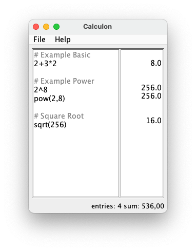

# Calculon

A basic, open-source, cross-platform, and "note-style" calculator inspired by [Numi](https://numi.app/).

Calculon is written in Java and uses the [exp4j](https://www.objecthunter.net/exp4j/) library for evaluating the mathematical expressions. It's developed with the Netbeans IDE and the Swing GUI Builder.

> **Note**
> On Windows, when using the `Calculon.exe` installer, the binary is automatically installed into the "Program Files\Calculon" folder.
